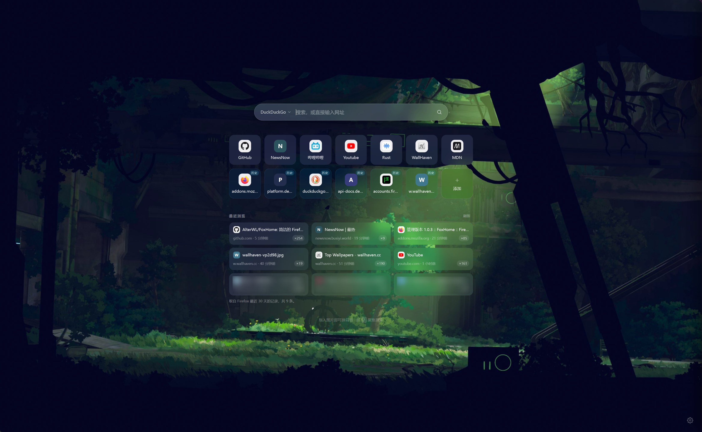
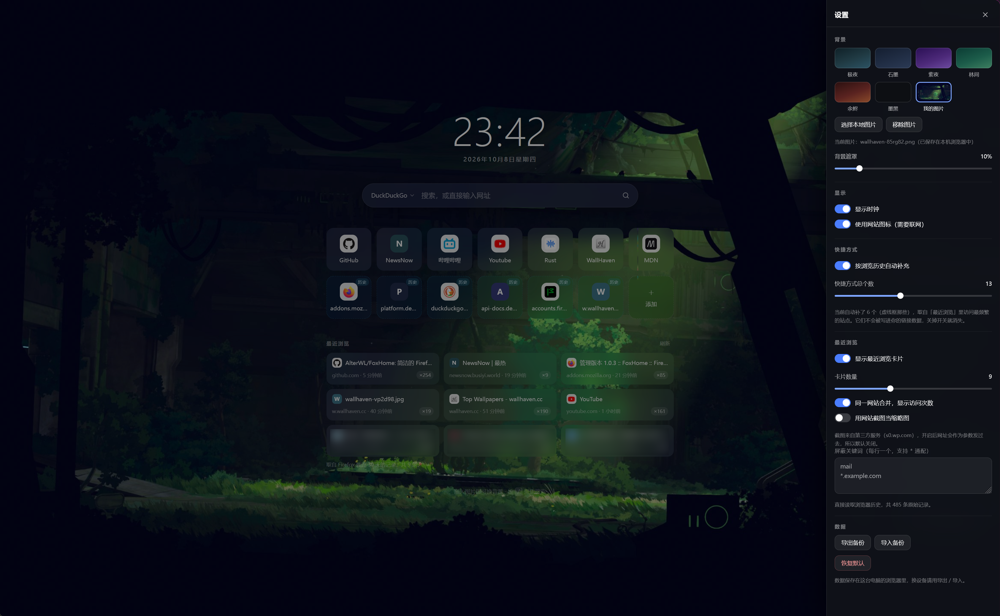

# FoxHome

一个给自己用的 Firefox 起始页：自定义背景 + 快捷方式 + 搜索框 + 最近浏览，界面尽量干净。



> 界面效果取自实际使用环境。

做成一个本地扩展，**装上新标签页就是它**；页面本身是纯静态 HTML/CSS/JS，没有依赖、没有构建步骤、完全离线可用。

- **新标签页 & 主页**：扩展用 `chrome_url_overrides` / `chrome_settings_overrides` 接管，装好即生效，不用手动设置
- **背景**：内置 6 套渐变/纯色，可上传自己的图片（也可以直接把图片拖到页面上），带背景遮罩调节
- **搜索**：Google / 必应 / 百度 / DuckDuckGo 一键切换，输入网址会直接跳转而不是去搜索
- **快捷方式**：手动增删改、拖拽排序；还能按浏览历史**自动补充**常访问的站点，总个数可设
- **最近浏览**：把 Firefox 的真实历史做成卡片，可设数量、同域名合并显示次数、关键词屏蔽；默认不联网
- **其它**：时钟（可关）、网站图标（可关）、`/` 聚焦搜索、数据全部存在本机

---

## 一、让它生效

### 新标签页（Ctrl+T）—— 装好扩展就自动接管

扩展用 `chrome_url_overrides.newtab` 把新标签页换成了这个页面，**不需要任何设置**：装好扩展，按 `Ctrl+T` 看到的就是它。

### 启动浏览器 / 新窗口 —— 1.0.2 起扩展自动接管

从 1.0.2 开始，扩展在 manifest 里声明了：

```json
"chrome_settings_overrides": { "homepage": "index.html" }
```

所以**装好之后主页就是它**，一样不用你去设置里填 URL。这是 Firefox 里唯一能让扩展设置主页的途径 —— `browserSettings.homepageOverride` 是**只读**的，运行时改不了，只能这样静态声明。

两点需要知道：

- **安装时 Firefox 会提示"扩展想要更改你的主页"**，同意即可；这是这类覆盖的常规提示，你随时能在 `about:preferences#home` 里改回去。
- 如果你之前手动把主页填成了 `file:///...` 路径，建议到 `about:preferences#home` 把它恢复成「Firefox 主页」—— 现在由扩展负责，手动那份会被扩展的声明盖过，留着容易看糊涂。

**已知限制**：启动时 Firefox 有可能在扩展加载完成之前就去取主页，此时 `moz-extension://` 资源还没注册，会出现**一瞬间的空白页**。按下 `Ctrl+T` 就回到起始页。这是 Firefox 的启动时序问题（社区从 2018 年就有报告），不影响新标签页。

### 版本变更

| 版本 | 变化 | 要不要手动做什么 |
| --- | --- | --- |
| 1.0.0 | 首个版本：历史桥 + 独立 `file://` 页面 | — |
| 1.0.1 | 页面搬进扩展，用 `chrome_url_overrides` 接管**新标签页** | 路径变成 `FoxHome/extension/index.html`；**数据要迁移一次**（`file://` 和 `moz-extension://` 的本地存储互不相通）：旧页面「导出备份」→ 新标签页「导入备份」 |
| 1.0.2 | 用 `chrome_settings_overrides` 把**主页**也接管 | 什么都不用做（数据不受影响） |
| 1.0.3 | 快捷方式区支持**按浏览历史自动补充**，总个数可设 | 什么都不用做（新设置默认开启，原有链接和背景不受影响） |
| 1.0.4 | 为公开上架精简：移除 `file://` 模式的桥接代码（`content.js` / `background.js`），扩展只剩「接管新标签页 + 主页」一个职责 | 如果你以前直接用 `file://` 路径打开过这个页面，那条路不再能读到历史了（改用新标签页或主页）；已保存的数据不受影响 |

旧路径的文件已被替换、而你之前也没特意配过链接或背景的话，那就是默认值，直接往下用即可。

---

## 二、怎么用

| 操作 | 说明 |
| --- | --- |
| 搜索 | 输入关键词回车，用当前选中的搜索引擎 |
| 打开网址 | 直接输入 `github.com`、`localhost:3000` 这类地址会直接跳转，不走搜索 |
| 换搜索引擎 | 点搜索框左边的引擎名字，选一个（会记住） |
| 加链接 | 点快捷方式区最后的「+ 添加」，填名称（可留空，自动用域名）和网址 |
| 改 / 删链接 | 鼠标移到快捷方式上，右上角出现铅笔和垃圾桶按钮 |
| 调整顺序 | 直接拖拽卡片到目标位置 |
| 用自动补充的快捷方式 | 带「历史」角标的那些是只读的（点开即用，不能改/删/拖）；不想要就在设置里关掉自动补充 |
| 换背景 | 右下角齿轮 → 「背景」里点色卡，或「选择本地图片」 |
| 拖图片换背景 | 把图片文件从资源管理器直接拖到页面上 |
| 调暗背景 | 齿轮 → 「背景遮罩」滑块，往右更暗，文字更清楚 |
| 刷新历史 | 「最近浏览」标题右侧的「刷新」按钮 |
| 备份 | 齿轮 → 「导出备份」下载一个 JSON 文件 |
| 恢复 | 齿轮 → 「导入备份」选之前的 JSON；「恢复默认」清空一切回到初始状态 |

设置项都收在右下角的齿轮里 —— 「最近浏览」和「快捷方式」的开关、数量、屏蔽词都在那：



### 快捷方式区（搜索框下面那排）

| 位置 | 来源 | 能做什么 |
| --- | --- | --- |
| 前面几张 | 你手动添加的 | 改名、删除、拖拽排序 |
| 后面几张 | 按浏览历史自动补的（虚框 + 青色描边 +「历史」角标） | 只读，点开即用 |

自动补充的几个要点：

- **不落库**：每次渲染现算，**不写进 `links` 数据** —— 关掉开关立刻恢复原样，「导出备份」里也不会带上它们，更不会出现"删掉了下次又冒出来"。
- **怎么挑**：沿用「最近浏览」那套过滤（屏蔽词、同域名合并、只保留 http(s)），**排掉你已经手动加过的站点**，剩下的按最近 30 天的访问次数从高到低取，同频次看谁更近。
- **数量**：齿轮 →「快捷方式」里设**总个数**（手动 + 自动，1~30，默认 12）。手动链接已经占满总数时就不再补。
- **和「最近浏览」相互独立**：关掉「最近浏览」卡片不影响快捷方式补充；反过来关掉自动补充，历史卡片照常显示。

### 快捷键

| 键 | 作用 |
| --- | --- |
| `/` | 聚焦搜索框 |
| `Ctrl` + `K` | 同上 |
| `Esc` | 关闭面板/对话框，或让搜索框失焦 |
| `Enter` | 搜索或打开网址 |

---

## 三、扩展在做什么

只有一个职责：**接管新标签页和主页**。

用 `chrome_url_overrides.newtab` 把新标签页换成这个起始页，用 `chrome_settings_overrides.homepage` 把主页也指过来。这类页面有特权 API 权限，所以页面自己就能调 `browser.history` 读浏览历史 —— 不需要后台脚本，也不需要 content script。

所以扩展的权限只有一项 `history`，代码里没有中转、没有消息通道。数据只在你自己的电脑上从浏览器流向页面，**不经过任何服务器**。

> 这个页面也可以直接用 `file://` 路径在浏览器里打开（看布局、调样式都行），但那时浏览器不会把 `browser` 暴露给页面脚本，所以**读不到浏览历史** —— 这是浏览器的安全边界，不是 bug。

### 安装

**装签名版（推荐，重启不失效）**：见「七、发布到 AMO」—— 签名完下载 `.xpi`，在 `about:addons` 里从文件安装。

**临时载入（改代码时自测用）**

1. `about:debugging#/runtime/this-firefox` → **「临时载入附加组件…」** → 选 `extension/manifest.json`
2. 新标签页应该立刻变成起始页（临时载入同样支持 `chrome_url_overrides`）

> ⚠️ 临时载入的扩展**在 Firefox 重启后会失效**，改完代码要重新载入一次。

### 可调的项（齿轮 → 「最近浏览」）

| 设置 | 说明 |
| --- | --- |
| 显示最近浏览卡片 | 总开关，关掉则整块隐藏（也不会去请求扩展） |
| 卡片数量 | 1 ~ 24 张，默认 8 张 |
| 同一网站合并，显示访问次数 | 同域名只留一张卡（取最近访问的那条），右下角显示累计访问次数 |
| 用网站截图当缩略图 | 默认**关闭**。开启后会向第三方服务 `s0.wp.com` 请求缩略图，**网址会作为参数发给它**；首次请求对方可能还在生成，显示为空白，稍后刷新即可，失败会自动退回纯文字卡片 |
| 屏蔽关键词 | 每行一个，支持 `*` 通配。匹配范围是网址 + 标题 + 域名，命中就整条丢掉 |

屏蔽词的实际语义：

- 不写 `*` 时按「包含」匹配 —— 写 `mail` 就能挡掉 `mail.qq.com`、`gmail.com`
- 写 `*` 时星号是通配，但**仍然不要求从头匹配**（因为匹配的是完整的 `https://…`）—— `mail.*`、`*.example.com` 都符合直觉

查询范围固定为**最近 30 天**、最多 500 条（`extension/assets/core.js` 里的 `HISTORY_DAYS` 可改）。

---

## 四、数据放在哪

所有设置和链接都存在 **这台电脑上的浏览器本地存储**里（localStorage，键名 `foxhome.v1`），不会上传到任何地方。浏览历史本身不落盘，每次都是现读现用。

需要注意：

- **数据存在扩展自己的来源下**（`moz-extension://…`），所以跟项目放在哪个目录、文件夹叫什么名字都无关了 —— 挪动、改名都不会丢数据。但**卸载扩展会连数据一起清掉**，所以还是建议偶尔「导出备份」。
- 清理浏览数据（勾选了「网站数据 / 离线缓存」）、换浏览器、换电脑，同样会丢，所以建议偶尔导出一次备份。
- 上传的背景图片会被压缩（长边最多 2560px，转 JPEG）后以 base64 存在同一处，只保留最近一张；不需要了可以在设置里「移除图片」。
- 本地存储总量约 5 MB，所以超大背景图会被压到 1.4M 字符以内；如果还放不下，页面会给出提示。
- 扩展只申请了 `history` 一项权限（Firefox 会明确提示），它只用于「最近浏览」卡片和快捷方式的自动补充，读到的数据在本机渲染、不外传。

---

## 五、按自己的口味改默认值

打开 `extension/assets/core.js`，顶部几处常量就是所有可定制项，改完刷新页面即可生效：

| 常量 | 作用 |
| --- | --- |
| `ENGINES` | 搜索引擎列表（加一条就能多一个引擎） |
| `PRESETS` | 内置背景，`css` 直接写 CSS 的 `background` 值，渐变或纯色都行 |
| `DEFAULT_LINKS` | 首次打开时的默认快捷方式（只影响没数据时的初始状态） |
| `DEFAULT_OVERLAY` | 背景遮罩的默认强度，`0 ~ 0.8` |
| `HISTORY_DAYS` / `HISTORY_DEFAULT_COUNT` / `HISTORY_MAX_COUNT` | 历史查询天数、默认卡片数、卡片数上限 |
| `SHORTCUT_DEFAULT_TOTAL` / `SHORTCUT_MIN_TOTAL` / `SHORTCUT_MAX_TOTAL` | 快捷方式总个数的默认值与可调范围 |
| `STORAGE_KEY` | 本地存储键名，改掉等于换一份干净的数据 |

样式集中在 `extension/assets/styles.css`，颜色、圆角、模糊强度都在文件开头的 `:root` 变量里，比如想让整体更透亮，调 `--glass` 和 `--veil` 即可。

---

## 六、文件结构

```
extension/index.html          起始页结构（也是被扩展接管的新标签页与主页）
extension/assets/styles.css   全部样式，含浅色文字与「玻璃」卡片的视觉效果
extension/assets/core.js      纯逻辑：网址解析、搜索引擎、快捷方式与历史处理、数据清洗
extension/assets/app.js       页面行为：渲染、交互、图片压缩、本地保存、读取历史
extension/manifest.json       扩展清单（MV3）
extension/icons/*.png         扩展图标（16/32/48/96/128，脚本生成）
docs/*.png                    README 里用的截图
docs/amo-listing.md           AMO 上架素材（摘要、描述、审核员备注、隐私政策）
tests/core.test.js            core.js 的测试（82 项）
tools/lib.js                  PNG 编码 / ZIP 打包 / CRC32，零依赖
tools/make-icons.js           生成扩展图标，含多尺寸预览与场景图模式
tools/pack.js                 打包扩展（上传 AMO）或整个项目（源码审核）
tools/check-commit-msg.js     提交信息校验器
tools/git-hooks/commit-msg    校验钩子（core.hooksPath 指向这里）
CONTRIBUTING.md               提交信息规范（约定式提交）
.gitmessage                   提交模板
LICENSE                       GPL-3.0
```

整个扩展（含页面）都在 `extension/` 里，就是上传 AMO 的那一份；`tools/` 和 `tests/` 只在开发时用，不会被打包进去。项目里没有 `node_modules`，也没有打包产物（`dist/` 是生成的 zip，可以随时删）。

`core.js` 不碰 DOM，所以测试可以直接用 Node 跑（改完 `core.js` 后建议跑一次）：

```bash
node tests/core.test.js
```

扩展相关的命令：

```bash
node tools/make-icons.js      # 重新生成 extension/icons/
node tools/pack.js            # 生成 dist/foxhome-<版本>.zip，用于上传 AMO
node tools/pack.js --source   # 生成 dist/foxhome-<版本>-source.zip，AMO 要源码时用
```

---

## 七、发布到 AMO（unlisted 签名）

扩展已经按 AMO 的提交要求配好了（MV3、图标、数据收集声明）。签名一次就能拿到**重启也不失效**的正式 `.xpi`，比每次临时载入省事。

### 1. 打包

```bash
node tools/pack.js
```

生成 `dist/foxhome-<版本>.zip`（当前是 `foxhome-1.0.3.zip`）并列出包内文件 —— AMO 要求 `manifest.json` 在压缩包根目录，脚本会保证这一点（它自己的 ZIP 写入器，不依赖系统压缩工具）。

### 2. 上传签名

1. 注册并登录 [AMO 开发者中心](https://addons.mozilla.org/developers/)（免费）。
2. 打开 <https://addons.mozilla.org/developers/addon/submit/>。
3. 选择 **「On your own site」（unlisted）** —— 只在 AMO 留档并签名，**不会公开列出来**，也不用准备列表页截图和长描述。
4. 上传上面那个 zip，等自动校验通过。
5. 在开发者后台的版本页面下载签名好的 `.xpi`。

这个扩展没有远程代码、权限也只有 `history` 一项，通常走自动校验，几分钟内出结果。

### 3. AMO 问「是否使用过代码生成 / 合并 / 模板等工具」时

**答「是」**，然后上传源码包。

原因：扩展里唯一的生成物是图标 —— `extension/icons/*.png` 由 `tools/make-icons.js` 渲染生成，正落在问题里"对文件二次处理并生成扩展中的文件"这一条上。JS 本身是手写、未压缩、未打包的，但如实回答才不会留下"提供不实信息"的把柄（AMO 政策对这一点很认真）。

```bash
node tools/pack.js --source     # 生成 dist/foxhome-<版本>-source.zip
```

包里是完整项目（扩展、图标生成脚本、测试、说明），并自动附带一份**英文说明 `SOURCE-NOTES.md`**，AMO 表单里那段说明可以直接抄它：

> The HTML, CSS and JavaScript that ship in the add-on are hand-written, unminified, untranspiled and unbundled. `manifest.json`, `index.html` and `assets/*` are copied byte-for-byte into the signed package. The only generated files are `extension/icons/*.png`, produced by `tools/make-icons.js` — rendered pixel by pixel in plain JavaScript and encoded to PNG with Node's built-in `zlib`; no third-party packages, no network access.

图标生成是**确定性**的（同样的脚本产出完全相同的字节，已实测），审核员可以自己重跑 `node tools/make-icons.js` 验证。

### 4. 安装签名版

`about:addons` → 右上角齿轮 → **「从文件安装附加组件…」** → 选下载的 `.xpi`。

装好后**重启 Firefox 也不会失效**；文件访问权限在安装时一并确认，不用再手动去扩展详情里勾。

### 关于数据声明

AMO 从 2025-11-03 起要求**新提交**的扩展在 manifest 里声明数据行为，不收集数据也必须显式写。本扩展不收集、不传输任何数据，所以是：

```json
"data_collection_permissions": { "required": ["none"] }
```

注意 `required` 里只能写 `none`，不能和别的项并列（并列会直接校验失败）。这个字段 Firefox 140 才开始认识，更老的版本会忽略它，不影响使用。

### 可能遇到的两件事

**「此附加组件的 ID 已被使用」**：`foxhome@local` 被别人占了。把 `extension/manifest.json` 里 `gecko.id` 改成更独特的（例如 `foxhome-history@local`），重新打包上传。

**重新提交被拒**：每次提交都要把 `manifest.json` 的 `version` 往上加（`1.0.1`、`1.0.2`…），改完重新跑 `node tools/pack.js`。

### 想换图标

图标是脚本画出来的（零依赖：自己写的 PNG 编码 + 超采样抗锯齿），不用设计软件：

```bash
node tools/make-icons.js                                              # 用当前变体重写 extension/icons/
node tools/make-icons.js --preview=icon-preview.png                   # 多尺寸对比图
node tools/make-icons.js --scene=icon-scene.png --variants=tab,page   # 放进 about:addons 真实场景对比
node tools/make-icons.js --variant=sunrise                            # 换一个变体，再跑上面的命令
```

可选变体（`--variant=` 的值）：

| 变体 | 形状 |
| --- | --- |
| `tab` | 浏览器标签页 —— **当前使用的** |
| `page` | 一张页面（右上折角） |
| `window` | 浏览器窗口 + 页内搜索框 |
| `search` | 一个大搜索框 |
| `home` / `home-grid` | 房子 / 房子加门窗 |
| `grid` | 2×2 快速拨号网格 |
| `sunrise` | 日出 + 地平线 |
| `cards` / `clock` / `timeline` | 叠放卡片 / 时钟回转箭头 / 时间轴 |

底色是青蓝渐变（比起始页的「极夜」背景**亮一档**）—— 这样在 Firefox 深色主题的 `about:addons` 卡片上也能立住；原来的深色底会融进卡片、只剩白色图形可辨。用 `--scene` 可以直接对比这两种背景下的效果。

---

## 八、常见问题

**按 Ctrl+T 还是 Firefox 的默认页？**
依次确认：扩展在 `about:addons` 里是**已启用**状态；没有装其它接管新标签页的扩展（比如 New Tab Override —— 多个扩展抢新标签页时 **Firefox 是"先运行的那个赢"**，和我们相反，而且它默认关闭其实不生效，禁用或卸载它即可）；`about:debugging` 里 FoxHome 没有报错。改完记得开一个新标签页验证。

**启动浏览器还是默认页？**
1.0.2 起扩展会自己声明主页，装完正常就该是它。如果还是默认页，按顺序查：

- **装的是 1.0.1 或更早** → 那时扩展不管主页，需要在 `about:preferences#home` 手动填 `file:///E:/Files/Codes/FoxHome/extension/index.html`
- **「常规」面板里勾着「打开上次的窗口和标签页」** → 它和主页设置写的是同一个 `browser.startup.page`，勾上后恒为 `3`，主页被覆盖。取消勾选
- **启动瞬间闪一下空白页，然后才是（或不是）页面** → 就是「一、让它生效」里说的启动时序问题，按 `Ctrl+T` 即可

**升级后链接和背景没了？**
1.0.0 → 1.0.1 把页面从 `file://` 搬进了扩展，两者的本地存储互不相通。用旧页面的「导出备份」+ 新标签页的「导入备份」迁移一次即可；详见「一、让它生效」里的版本变更表。

**「最近浏览」显示读不到历史？**
正常情况下新标签页和主页都能读到。如果出现这个提示：
- **确认你是通过扩展打开这个页面的**（按 `Ctrl+T`，或用工具栏的主页按钮）。如果直接用 `file://` 路径打开这个 HTML 文件，浏览器不允许页面读历史 —— 这是安全边界，不是 bug。
- **在扩展接管的新标签页里仍读不到**：说明没拿到 `history` 权限。去 `about:debugging` → FoxHome → 「检查」看控制台报错，或在 `about:addons` 里确认权限没被关掉。

**图标有的是彩色，有的是字母方块？**
卡片会尝试加载 `网站域名/favicon.ico`，需要联网。取不到（或站点没放这个文件）就退回「首字母 + 按域名生成的配色色块」，属于正常回退。不想要网站图标可以在设置里关掉。

**输入了网址却被拿去搜索了？**
只有看起来确实是网址的输入才会直接跳转：带点的域名、`localhost`、IP、或者 `http(s)://` 开头。含空格、或者带 `:` 但不是 `host:port` 形式的内容一律当搜索词（这样 `javascript:` 之类的伪协议不可能被当成地址打开）。

**开了截图缩略图，卡片是空白？**
`s0.wp.com` 首次遇到一个网址时需要现生成缩略图（几秒到几十秒），期间返回的是空白图；过一会儿刷新就好，生成过的会缓存。如果站点禁止被截图，就会一直是空白 —— 此时建议关掉这个开关。注意开启后每次都会把你的网址发给这个第三方服务。

**打开页面一片黑，只有背景？**
说明 `assets/` 下的文件没找到。确认 `extension/assets/` 里有 `styles.css`、`core.js`、`app.js`，并且页面是通过它自己的 `index.html` 打开的（不是单独打开某个 js/css）。

**换电脑怎么迁移？**
旧电脑上「导出备份」，把 JSON 拷到新电脑；新电脑打开页面 → 齿轮 → 「导入备份」。背景图片会一起打包在 JSON 里，所以备份文件可能比较大，属正常。扩展需要在每台电脑上分别载入。
